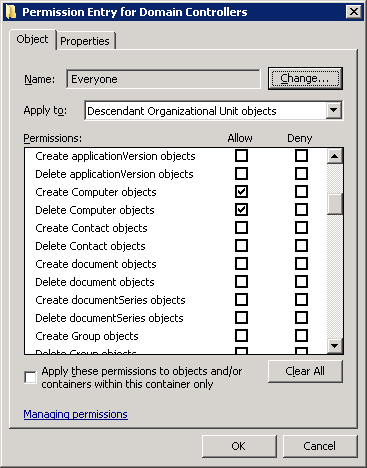
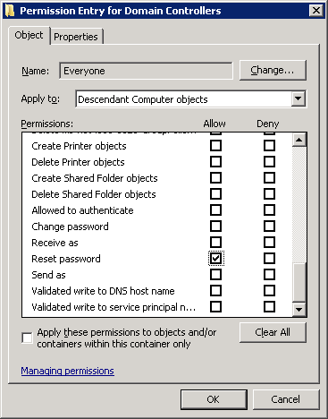

Title: Active Directory's Object Specific ACEs and PowerShell
Date: 2011-11-24 09:36
Category: Microsoft
Tags: Security, Scripts, PowerShell, Active Directory
Slug: active-directory-object-specific-aces
OldSlug: active-directorys-object-specific-aces

I recently checked the option of handing out AD permissions through PowerShell scripts, and I found out that setting object-specific ACEs is not trivial scriptwise.  
Active Directory ACE (access control entries) are different from your regular ACEs (for example, NTFS), because they can be used to grant permissions only on specific types of objects, and to propagate only to specific types of child objects.  

  
Example - Granting `Everyone` the right to create `Computer` objects in `child OUs`

  
Example - Granting `Everyone` the `reset password` right, but only on `Computer` objects (rather than user accounts)

My question is - how do I replicate this in PowerShell?  
After granting the "create computer objects in child OUs" right (pic1)
and loading the Active Directory module, If I fetch all of the relevant
permissions thusly:  

~~~~powershell
get-acl 'AD:\OU=Domain Controllers,Dc=contoso,DC=com' | select -exp Access | ?{$_.IdentityReference -match 'Everyone'}
~~~~

I get the following output:
~~~text
ActiveDirectoryRights : CreateChild, DeleteChild
InheritanceType       : Descendents
ObjectType            : bf967a86-0de6-11d0-a285-00aa003049e2
InheritedObjectType   : bf967aa5-0de6-11d0-a285-00aa003049e2
ObjectFlags           : ObjectAceTypePresent, InheritedObjectAceTypePresent
AccessControlType     : Allow
IdentityReference     : Everyone
IsInherited           : False
InheritanceFlags      : ContainerInherit
PropagationFlags      : InheritOnly
~~~
Note that the `ActiveDirectoryRights` granted are `CreateChild` and `DeleteChild`, which are generic, NTFS-ish rights. The interesting parts here are `ObjectType` and `InheritedObjectType`, Both contain well known IDs representing AD object types.  
All object type guids are available in the `schema` partition, on the property `schemaIDGUID`. To look up for the object type matching `bf967a86-0de6-11d0-a285-00aa003049e2`, you could use:
~~~~powershell
$RawGuid = ([guid]'00299570-246d-11d0-a768-00aa006e0529').toByteArray();
get-adobject -fi {schemaIDGUID -eq $rawGuid} -SearchBase (Get-ADRootDSE).schemaNamingContext -prop schemaIDGUID | Select name,@{Name='schemaIDGUID';Expression={[guid]$_.schemaIDGUID}}
~~~~
And now we discover that the field `ObjectType` contains the `SchemaIDGUID` of `Computer`:
~~~text
name                                                        schemaIDGUID
----                                                        ------------
Computer                                                    bf967a86-0de6-11d0-a285-00aa003049e2
~~~
In a similar method we can find that "InheritedObjectType" contains "Organizational-Unit". In order to create your own ACE, you simply have to find the right IDs to put in those fields, and continue to set the ACL normally.  
Have a safe directory!
