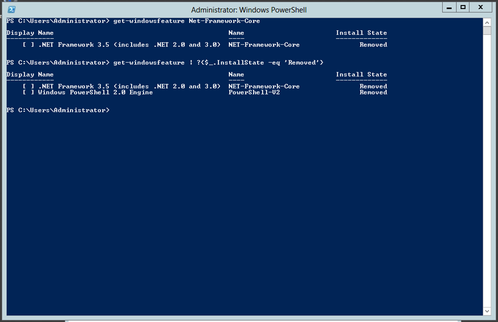
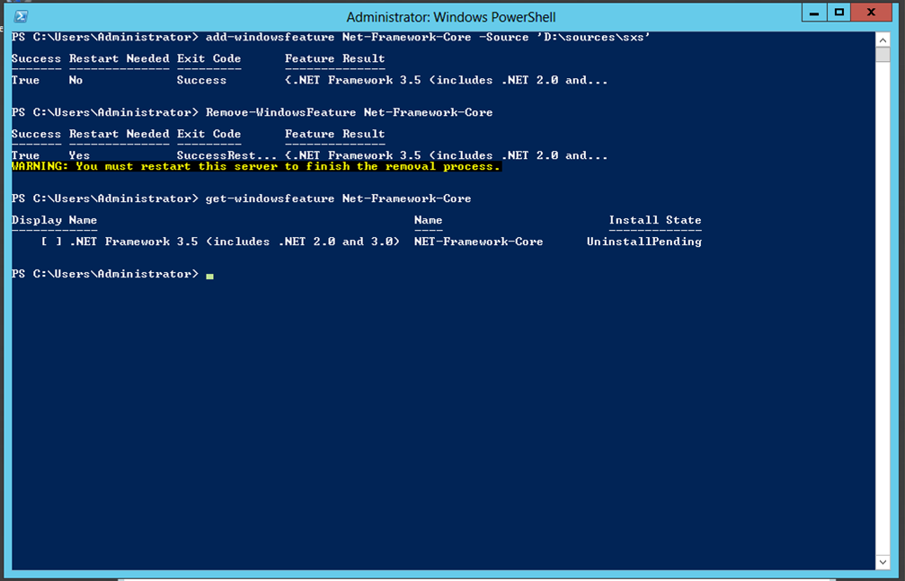
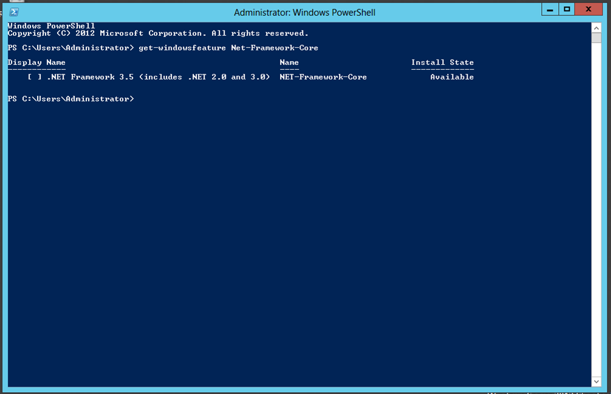

Title: Adding .net 3.5 to a Windows Server 2012 template
Date: 2013-06-28 10:48
Tags: Scripts, Windows, Virtualization, PowerShell
Slug: adding-net-35-to-windows-server-2012-template
OldSlug: adding-net-35-to-windows-server-2012
Category: Microsoft

I was approached by some colleagues building a new VM template for
Windows Server 2012 who wanted some help with .NET framework 3.5.  
  
###The .NET oddity
As anyone who messed a bit with Windows Server 2012 knows, the .NET
framework 3.5 is one of two features (along with PowerShell v2, contrary
to v3) whose status is `removed`, meaning it's not installed **and** the installation sources aren't
available in the Windows directory, so that in order to install it you
have to supply an installation source - either the "sources" folder from
the CD or access to the Microsoft Update service (and no, WSUS won't do
for now).

###Why I care
Contrary to Microsoft's optimistic view of the software world, almost
all modern .NET-based software run on version 3.5-, not on 4+, so I'm
going to have to install this feature on a lot of servers.
###What we did
At first I saw two options:  

-   Avoid installing the feature, causing myself a serious amount of
    work (either some manual action or complicated scripting) every time
    I want to create a VM with .NET 3.5,
-   Install the feature on the template, causing all VMs to come
    equipped with the feature and relying on my colleagues (and
    future-self) to remove the feature where it's not needed (requires a
    restart) or expose the VM to unnecessary security/performance
    issues.

After some thinking and tinkering, I came up with a 3rd option - I'll
install the feature on the template then immediately remove it, changing
its state from `removed` to `available`, thus making the feature itself
unavailable, but the installation sources present in Windows' "sources"
folder, meaning it can be easily installed in the future without
external media!

###The Steps
1.  Get a model VM (clean setup of Windows Server 2012 is best)
2.  Make sure you have the additional sources. If you're connected to
    the internet, you're set. If not, get the "sources\\sxs" directory
    from the installation CD
3.  Add the feature and immediately remove it

        :::powershell
        Add-WindowsFeature Net-Framework-Core -Sources "SXSDIRECTORY"
		Remove-WindowsFeature Net-Framework-Core

	
	
4.  Restart the machine, e.g. using `Restart-Computer` and verify:
	
        :::powershell
		Get-WindowsFeature Net-Framework-Core

    

That's it!   
