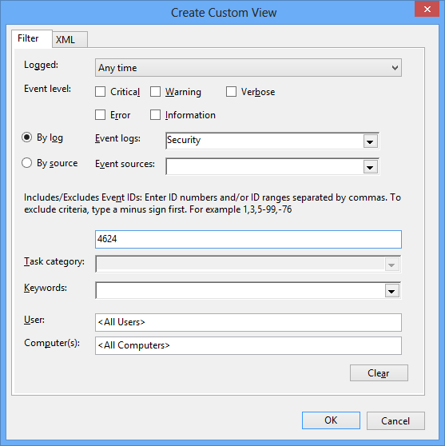
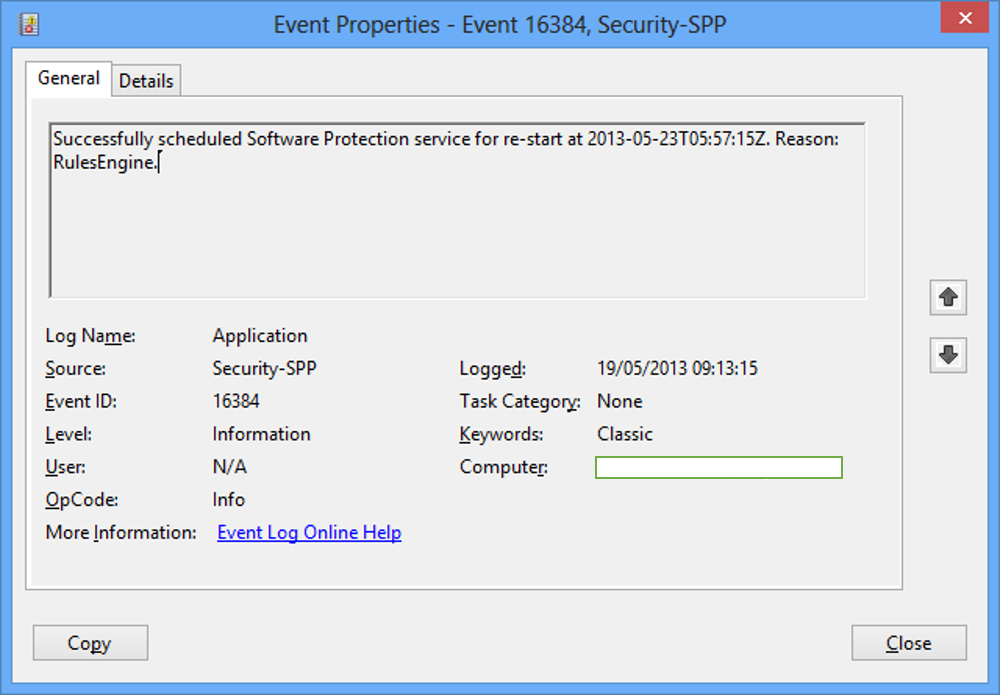
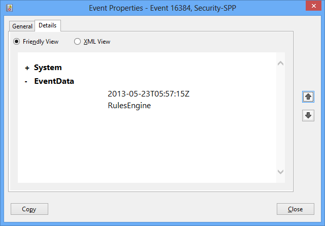
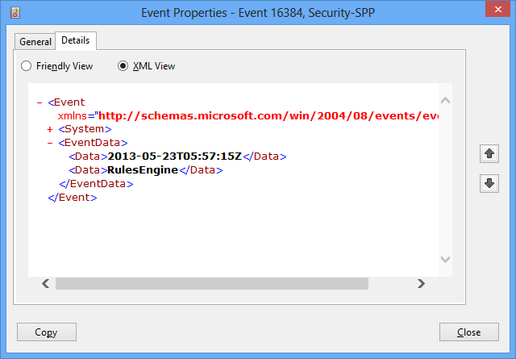
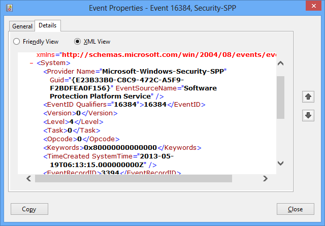
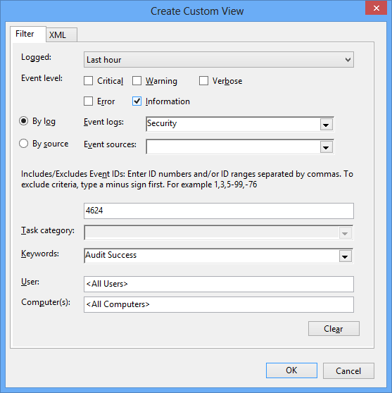
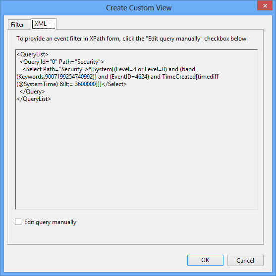
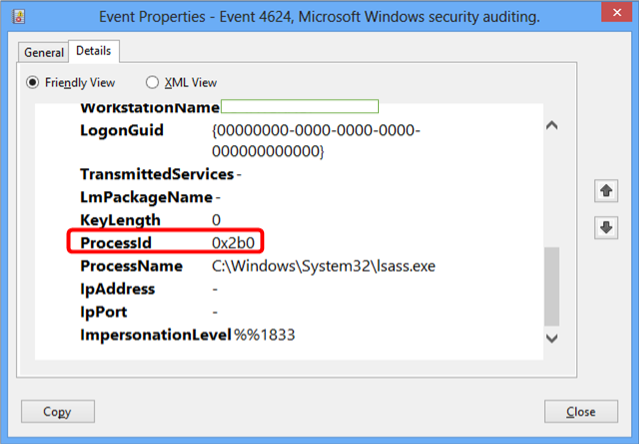

Title: Filtering Windows Event Log using XPath
Date: 2013-05-19 15:24
Category: Microsoft
Tags: Security, Scripts, Windows, PowerShell, Ramblings, Event Log
Slug: filtering-windows-event-log-using-xpath
OldSlug: filtering-windows-event-log-using-xpath

When I want to search for events in Windows Event Log, I can usually make do with searching / filtering through the Event Viewer. For instance, to see all 4624 events (successful logon), I can fill the UI filter dialog like this:   

- **Event Logs:** Security
- **Event IDs:** 4624

But sometimes I need higher granularity. That's when XPath comes in.  
  
### What is XPath
Xpath is a method for selecting specific XML nodes from an XML document.  
Given a list of books in XML, one can select the third book, the book with the most pages or the book with the author "David" with a single, human-readable XPath statement.  
  
### Usage in Windows Event Log
Since Windows NT6 (Vista / Server 2008), events are saved in XML format.  
If we'll take a look in event 16384:  

The general message (`Successfully scheduled Software Protection service for re-start at {0}. Reason: {1}.`) is saved in an external resource file, but the specifics (the replacement strings) are saved in the event.  
They can be viewed in a friendly view (`Details/Friendly`) or in their raw XML form (`Details/XML`):  

Also available are the general event details (computer name, event ID,
time generated), under the "System" Node:  

Not only can you filter events using XPath on the event's XML node, this is how the UI is actually filtering.  
If we make up some sort of filter:  

And switch to the `XML` view:  

we can see our selections reflected in the XPath statement contained in the `Select` element.  
Note `(EventID=4624)` for filtering by event ID, for example.

### Using XPath Filtering
To filter events using XPath, you need:

-   Basic XPath skills
-   A sample event to examine its structure
-   A way to filter

#### Basic XPath skills
- You can learn basic queries on the w3c site: <http://www.w3schools.com/xpath/>  
- Windows Event Log XPath filtering uses a subset of XPath 1.0 with some serious limitations, which can be found here: <http://msdn.microsoft.com/en-us/library/dd996910(VS.85).aspx#limitations>  
- You can always use the UI to build a filter, then switch to the XML view and see how it's represented in XPath.  

#### A sample event
When searching for specific fields within a certain event (e.g. 4624 where `Process ID` is `0x2b0`), it's always good to find a sample event, switch to `Details` and see how it's built. In my example, I can see the
field I need is `EventData/ProcessId`:  

And I can deduce that the XPath expression I need should be something
like:

~~~~text
Event[
 System[
  EventID=4624
 ] and
 EventData[
  Data[@Name="ProcessId"]="0x2b0"
 ]
]
~~~~

#### A Way to Filter
After you got the XPath query, you need to choose the right tool to run the query on.  
You can use:  

- UI (`EventVwr`)  
    To use your XPath query in EventVwr, choose one of these two options, switch to the `XML` card, enable `Edit query manually` and... edit the query.
    - Filter  
   Use the `Filter current log` button to get a one-time filter. Useful when you don't need to save the query for later
    - Custom View  
  Create a new custom view if you intend to reuse the query. Note that it's saved on the computer running the event viewer, not on the computer being queried.
- Cmd
    - `Wevtutil`  
	This tool is useful when managing event logs in general, but it also can be used to query for events. The usage is:
	
            :::bat
            wevtutil qe LogName /q:"XpathQuery"

        For more info, run:

            :::bat
            wevtutil qe /?

- PowerShell  
    - `Get-WinEvent`  
    This Cmdlet has 3 options for filtering. Choose one:

        - `FilterXml` - Accepts a full XML (as seen in the event viewer UI)
        - `FilterXPath` - Accepts just the XPath query
        - `FilterHashtable` - Accepts a hashtable of field IDs and values. I
        find it kind of confusing and buggy, so I avoid it.
		
        For example, to view the top 5 events matching our query (ID 4624
    and "Process ID" is "0x2b0") on computer "comp", you can try:

            :::powershell
            Get-WinEvent -ComputerName 'Comp' -LogName 'Security' -FilterXPath 'Event[System[EventID=4624] and EventData[Data[@Name="ProcessId"]="0x2b0"]]' -MaxEvents 5

**Pointers**

-   You can't specify both Channel ("Event Logs") and Provider ("Event
    Sources"). In any case, if you have the provider, the channel is
    redundant.
-   Specifying the Channel in the XPath query (like `Event[System[Channel="Security"]]`) doesn't seem to work. The UI also avoids it in its generated queries.
-   When querying for events using PowerShell, you might get empty messages. The useful event details are still there! For example, you can use `ToXml()` on the event objects to get the XML format.
-   General event properties (like `TimeGenerated` and `Level`) can be quite different than how they look in the UI. Check the friendly/XML view or the UI-generated XPath Query.
-   The event-specific properties are contained in "Data" elements. To search for named properties, use something like:

        :::text
        Event[EventData[Data[@Name="PropertyName"]="RequiredValue"]]

    To search for that value in any property (kind of like searching for
    the value in the entire message), use:

        :::text
        Event[EventData[Data="RequiredValue"]]

-   To search for two fields, use something like:

        :::text
        Event[ EventData[  Data[@Name="PropA"]="ValueA" and  Data[@Name="PropB"]="ValueB" ]]

### To Sum Up
It may look harder than normal filtering at first, but the resulting
queries can be much more granular and effective than UI-based filtering.
