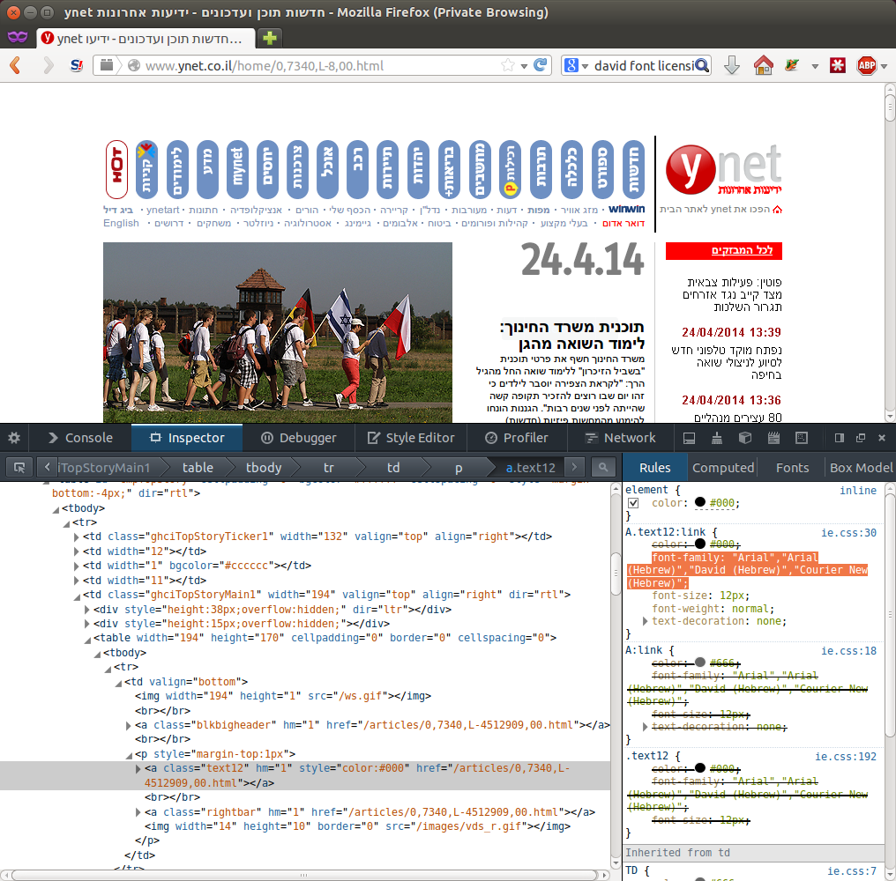

Title: Fixing Ugly Hebrew on Ubuntu + Firefox
Date: 2014-06-23 13:01
Category: FOSS
Tags: Linux, Fonts, HTML, Ubuntu, Firefox
Slug: fixing-ugly-hebrew-on-ubuntu-firefox
OldSlug: fixing-ugly-hebrew-on-ubuntu-firefox

The default viewing experience, when visiting some Hebrew sites when
using Firefox on Ubuntu, is quite unsightly.  
If we check [Ynet.co.il](http://ynet.co.il/), a news site, we'll see
this biblical font being used:  

Let's check which fonts Ynet asks to be viewed in:  

If you look at the marked part, you'll see something like:  

~~~~css
font-family: "Arial","Arial (Hebrew)","David (Hebrew)","Courier New (Hebrew)"
~~~~

Now we see the reason - a lot of sites were designed and tested for
Windows  (surprise!), and as such require fonts that aren't free
([libre](http://en.wikipedia.org/wiki/Gratis_versus_libre)).  
For example, the font "David" is not free to use [at
all](http://www.fonts.com/font/masterfont/david). Because of that, such
fonts are not included in Ubuntu by default.  
  
### The Solution
Use this following command, taken from [askubuntu](http://askubuntu.com/a/166995), to install Microsoft fonts.  

~~~~bash
sudo apt-get install ttf-mscorefonts-installer culmus
~~~~

Complete installation, refresh and voila:  

### Further reading
[Microsoft typography  - fonts](http://www.microsoft.com/typography/fonts/)  
[Microsoft Fonts at ubuntu.com](https://help.ubuntu.com/community/RestrictedFormats/Microsoft_Fonts)
