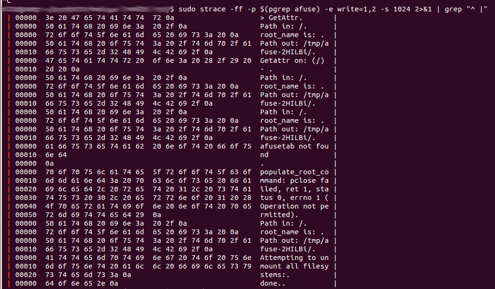
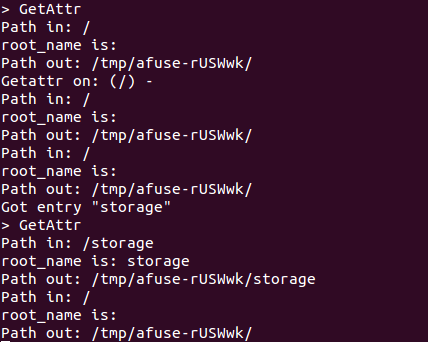

Title: Hijacking a process's i/o streams using gdb
Date: 2014-05-28 12:13
Category: FOSS
Tags: Scripts, Linux, gdb, Debugging, Bash
Slug: hijacking-processs-io-streams-using-gdb
OldSlug: hijacking-processs-io-streams-using-gdb

### The Story
I recently had a very annoying problem - some daemon failed, but ran
fine when told to run at foreground (not daemonize). Running at
foreground is the easiest way to debug processes, because that way you
get their input / output / error streams in your terminal.  
Said daemon had no "log to file" option as well, so the only indication
I had that something was wrong is that the daemon didn't do what it's
supposed to do.  
  
When processes daemonize, they create a sub process that isn't attached
to anything (so it won't be affected by the terminal closing, for
instance).  
The originating process usually exists after creating the sub process,
and so you can't easily capture the output of the sub process.  
  
I eventually realized that I need to "hijack" the `stderr` stream from the
sub process. I did some stupid attempts, like this (**NOT WORKING**):

~~~~bash
tail -f /proc/$(pidof $DAEMON)/ld/2
~~~~

Eventually I wrote something using strace, which was
OK:

~~~~bash
sudo strace -ff -p $(pidof $DAEMON) -e write=1,2 -s 1024 2>&1 | grep "^ |"
~~~~

It gave me the output I wanted, and I solved my issue (which was me
passing relative file locations, inaccessible to the sub process created
because it doesn't inherit the parent's working directory). However, I
wanted something more elegant. I found the commands in [this
post](http://gcolpart.evolix.net/blog21/capture-inputoutput-of-a-process-with-gdb/),
which did something better - given a `pid`, they redirect its input,
output and error streams to some `tty` (terminal), giving you control over
the process.  
However, it wasn't a fire-and forget script. I tried to fix that :-)  
  
### The Solution 
My script will hook the process to your current terminal.  
**Please note:** I don't think it's a good idea to leave the hijacked
daemon running after finishing troubleshooting. You should probably
restart it.

~~~~bash
DAEMON=afuse
MYT=$(tty)
sudo gdb -p $(pidof $DAEMON) <<EOF
call close(0)
call close(1)
call close(2)
call open("$MYT", 2, 0)
call dup(0)
call dup(0)
detach
EOF
~~~~

Notice the output - much better:  

The way the script works is this:  
First, it uses `tty` to find the path to the current terminal.  
gdb is then called to close streams 0,1,2 (which are almost always
`stdin`, `stdout`, `stderr`) and open a new stream to the `tty` found before.
The new stream opens at index 0 (because it's the lowest index
available, since we just closed 0,1,2) and copies it to 1 and 2 as well.
Now `stdin`, `stdout` and `stderr` are all mapped to the current terminal -
success!
