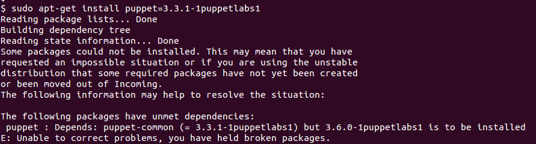
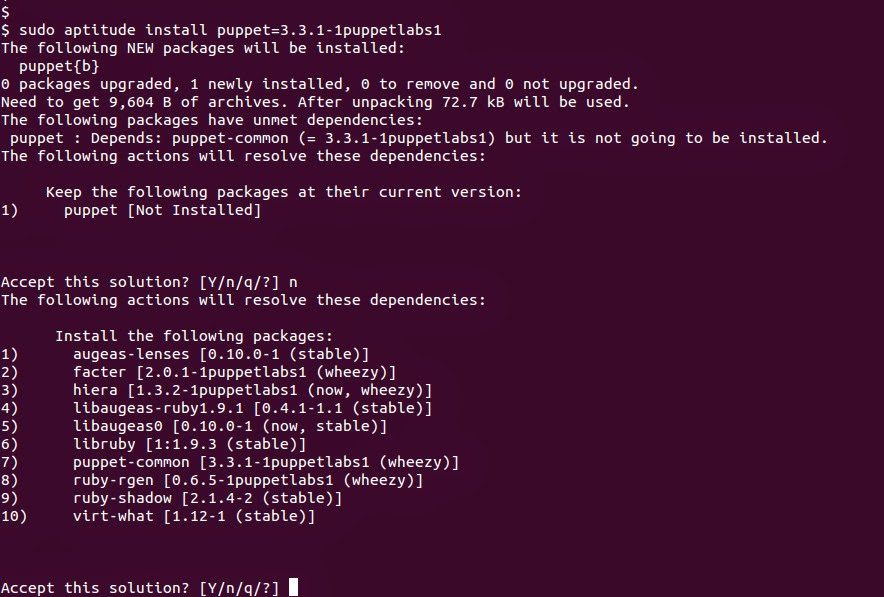
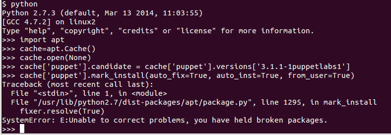
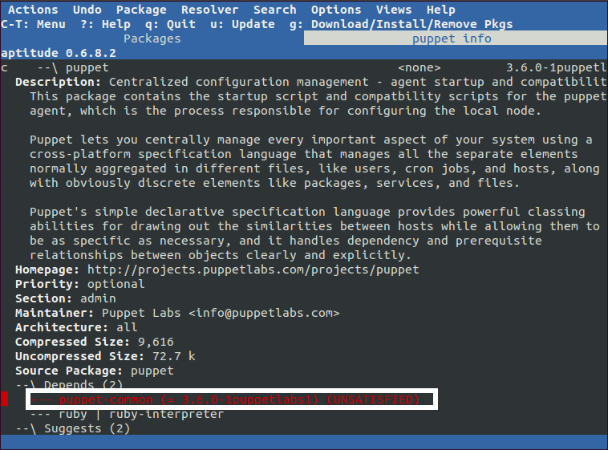

Title: My Pinning Guidelines
Date: 2014-06-14 12:10
Category: FOSS
Tags: Security, Linux, Debian, Apt
Slug: my-pinning-guidelines
OldSlug: my-pinning-guidelines

In my [previous post](why-pinning.html) about
pinning I talked about the reasons to configure apt pinning.  
This post details my logic about what and how to pin.

### Pinning technicalities
#### How pinning is done
The best way to pin stuff is to add files in `/etc/apt/preferences.d/`  
Those files are parsed whenever the package cache is updated (e.g. `apt-get
update`), and rules inside the files are applied to the packages.  
You can view the official documentation about pinning using:

~~~~bash
man apt_preferences
~~~~

#### What can you pin
Pinning is done on a per-option basis (package+version+origin), meaning
you can pin according to the different fields of an option. The field
details start at about line 289 in the `apt_preferences` man page.  
Most times, pinning is done according to a specific origin (as in
"pinning a repository") or according to a name and version ( as in
"pinning a version"). You can obviously mix and match for your needs,
but test the results using:   

~~~~bash
sudo apt-get update
apt-cache policy PACKAGENAME
~~~~

### What to pin
There is no "right way" to pin packages (only wrong ones).  
Pinning is supposed to reflect the administrator's opinion of "which version of the
package is best", so think of what rules you'd follow if you installed
all packages by hand, and try and see how you can explain that to apt.  
These are some strategies I thought of.  
  
#### Latest is best (default)
The default behaviour is preferring the latest version available. When
installing packages only from the stable Debian repositories, this is a
good idea since the only updates are critical bug and security fixes.  
It also saves you the trouble of keeping the package version locked (and
needing to update the lock later).  
  
#### Keeping a certain version
Some software repositories offer several versions of the same package,
and let you choose which version to install.  
Pinning the package to a specific version will tell apt to prefer  that version if available.  
**Note:** You might encounter dependency issues (see "version pinning and
dependencies" for the problem and possible solutions).  
  
#### Keeping a certain major/minor version
Like to the previous example, you may want to hold apt to a
specific major/minor version (e.g. puppet 3.1), but have it upgrade to
the highest build/revision (to allow bug/security updates that don't
modify behaviour). To do so, pin the package to a
[globbed](http://en.wikipedia.org/wiki/Globbing) version, like `3.1.*`
  
  
#### A last resort repository
Some packages aren't available in your official distribution's
repository, but are available on other repositories.  
For instance, [HAProxy](http://haproxy.1wt.eu/) isn't available on the
Debian stable repo, but is available on the Debian [backports
repo](http://backports.debian.org/). If we just add the backports
repository, apt will upgrade everything to the backports version (since
every package option there has the same priority and a higher version
number).  
If we instead add the repo and pin it to a lower priority, apt will only
take from it packages it can't find anywhere else.  
  
#### A high priority repository
Similar to the last example, you could have a company repo with packages
compiled especially for you - passing additional security audits,
containing critical features, etc. You want apt to prefer package
options in that repo over "normal" options, even if their version number
is lower. To do so, pin the repository to a higher priority than the
default. Remember that you have to keep this repository up to date,
because apt will avoid applying upgrades found in the "normal"
repositories.  
  
### Other points to consider
These aren't pinning strategies, but rather tips I picked up along they
way.  
  
#### Which priority numbers do I choose?
The examples don't contain actual priority numbers, since these are very delicate.  
Priority numbers do more than tell apt which option to prefer
- they modify apt's treatment of the package even further. The full
documentation is in the `apt_preferences` man page, but for instance:

- Priorities over 1000 instruct apt to install this package even if it
constitutes a downgrade
- Priorities lower than 100 will cause apt to only use this version if the package isn't installed at all (no upgrades).  

So choose your numbers carefully - if you don't want apt to change its
behaviour, stick to numbers around 500 (the default value).    
  
#### Version pinning and dependencies
  
When installing package dependencies (packages that are required for the
one you requested), to packages pinned by version, apt might behave
strangely:

-   The package may require a specific version of the dependency (for
    example, `puppet` 3.3.1 requires `puppet-common` **exactly** in version
    3.3.1)
-   When reviewing the dependency installation options, sorted by
    priority and version, the first result may be a different version
    (e.g. version 3.6.2)

In this situation, apt is in a pickle - it can't satisfy the dependency
requirement by installing the highest-priority option.  
Different apt front-ends treat this dilemma differently:

- **Apt-get** gives up, giving a weird error like `X: depends
Y(=LOWVERSION) but HIGHVERSION is to be installed`, combined with the
accusing statement `You have held broken packages`.  

    

- **Aptitude** offers several solutions (aptitude always does), one of
them is what we want (installing the dependency):  

    

- The **python apt module** will throw an exception, telling you the
automatic dependency resolution failed.  

    
 
**The solution** to this issue is to study the failed dependencies, and
pin them in the same way. Use aptitude's interactive UI to check for the
dependencies of your package, and find the ones with version constraints
(`=X.YY.ZZZZ`). Those are the ones you'll need to pin.  

Remember - wrong pinning could negatively impact your system's security,
performance, stability etc. Make sure you plan it carefully!
