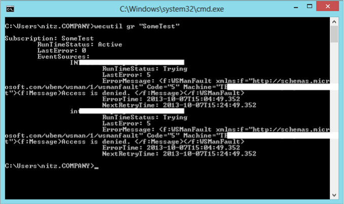

Title: Parsing Event Log Subscription Runtime Status using PowerShell and Regex
Date: 2013-10-12 16:00
Category: Microsoft
Tags: Scripts, Regular Expressions, Windows, PowerShell, Event Log
Slug: parsing-event-log-subscription-runtime-status
OldSlug: parsing-event-log-subscription-runtime

### The Story
Since Event Log Subscription doesn't have a module or a .NET class,
interacting with its settings and status has to be done either via UI or
the command line utility, `wecutil.exe`  
I was especially interested in getting the computers runtime status, to
see which machines are failing (and why).  
Let’s look at the output generated by `wecutil gr`:  

As we can see, every server's status is represented by multiple lines,
which rules out easy one-line-at-a-time parsing.  
Since Wecutil has no script-friendly output (e.g. CSV), I had to use multiline regex parsing.  
This is done by joining the lines using ``n` (since PowerShell returns
an array of rows rather than the complete string), using the .NET class
`Regex` ([System.Text.RegularExpressions.Regex](http://msdn.microsoft.com/en-us/library/system.text.regularexpressions.regex.aspx))
and creating a complicated regex pattern to parse by.  
My full script also supports remoting (using
[Invoke-Command](http://technet.microsoft.com/en-us/library/hh849719.aspx))
and parsing all of the fields into meaningful objects (e.g. extracting
the error messages out of the XML).  
The really interseting part is the regex pattern, especially these
parts:  

-   **Nonecapturing groups:** Using `(?:)` means the group isn't kept for
    data extraction
-   **Positive lookbehind:** both the beginning and the end of my string
    contain line-breaks, so I had to use lookbehind `(?\<=)` or lookahead
    `(?=)` (or both) groups to avoid "competition" for the same line-break
    between two close matches.
-   **Capturing ALL characters:** apperantly, `.` captures every
    character except `\n` (newline) so `(?:.|\\n)` will match every
    character. Although this difference isn't visible when dealing with
    single line expressions (since you don't encounter line breaks),
    it's vital when handling multiline ones.
-   **Optional segments:** The fields `ErrorMessage`, `ErrorTime` and
    `NextRetryTime` only appear when `LastError` isn't 0, so we can't
    mandate them in the pattern. On the other hand, we do want to
    capture them when they're present. Surrounding them all with
    `(?:`text`)?` will ensure that the entire expression won't fall if
    they're not present but populate the right capturing groups if they
    are.
-   **Reaching the real end:** The last line isn't terminated with a
    newline but rather with End-Of-String, so our string ends with
    `(?:\n|$)` to match either.

#### The Script

~~~~powershell
param(
    [string]$computerName,
    [parameter(Mandatory=$true)]
    [string]$subscriptionName
)
 
$wecUtil={wecutil gr $args[0]}
$splatTable=@{}
if($computeRName) {$splatTable['ComputerName']=$computerName}
$in = Invoke-Command @splatTable $wecUtil -ArgumentList $subscriptionName
$in2 = ($in -join "`n")
$pattern = '(?<=\n)\t{2}(?!\t)(.+)\n\t{3}RunTimeStatus: (.+)\n\t{3}LastError: (.+)(?:\n\t{3}ErrorMessage: ((?:\n|.)+?)\n\t{3}ErrorTime: (.+)\n\t{3}NextRetryTime: (.+))?(?:\n|$)'
[regex]::Matches($in2,$pattern,'Multiline') | %{
    $arr = $_.Groups | select -s 1 -exp value
    5| select `
    @{Name='Name';Expression={$arr[0]}},
    @{Name='RunTimeStatus';Expression={$arr[1]}},
    @{Name='LastError';Expression={[int]$arr[2]}},
    @{Name='ErrorMessage';Expression={
        $msg = ([xml]$arr[3]).WSManFault.Message
        if($msg -is [string]) {$msg}
        else {$msg.ProviderFault.ProviderError.'#text'}
    }},
    @{Name='ErrorTime';Expression={[datetime]$arr[4]}},
    @{Name='NextRetryTime';Expression={[datetime]$arr[5]}}
}
~~~~

  
#### Further Reading
- MSDN:  
    [Regular Expression Language - Quick Reference](http://msdn.microsoft.com/en-us/library/az24scfc.aspx)  
	[Grouping Constructs in Regular
Expressions](http://msdn.microsoft.com/en-us/library/bs2twtah.aspx)
