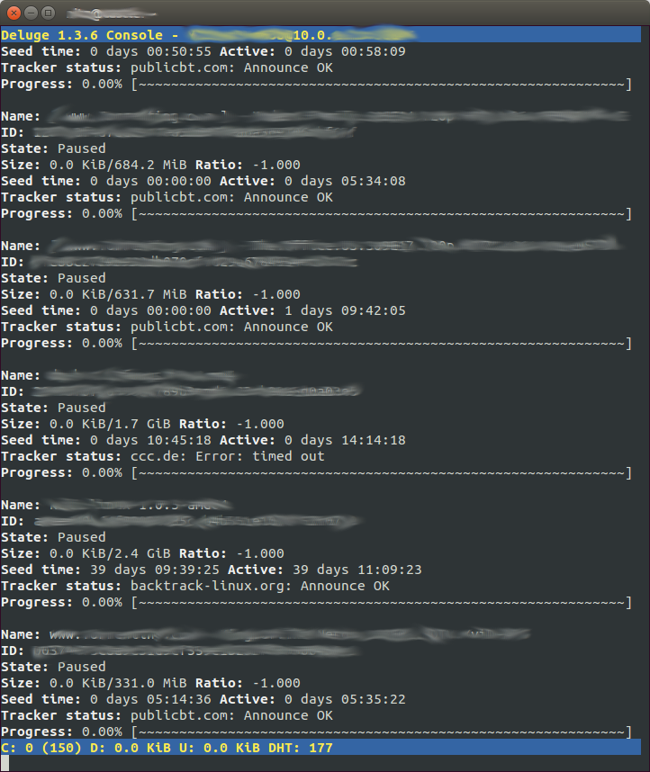

Title: Python Library for Deluge Torrent Maintenance
Date: 2014-06-23 13:05
Category: FOSS
Tags: Programming, Scripts, Raspberry Pi, raspberrySeed, Ramblings, Python, Deluge
Slug: python-library-for-deluge-torrent-maintenance
OldSlug: python-library-for-deluge-torrent

**Update:** I added [this project](https://github.com/BackSlasher/deluge_framework) as my first
GitHub repo  
  
I have an ongoing project which I nickname my raspberrySeed, which is a
Rasbperry Pi running Deluge. Works 24/7, takes very little power,
minimal heat, no noise, works as a fine seedbox.  
However, I recently encountered strange situtations in which the remote
Deluge UI (on my PC) would get stuck and eventually cause the Deluge
daemon (on the rPi) to crash.  
After some checking, I realized showing the UI is too demanding, at
least with the amount of torrents I'm seeding. Time to weed out some
torrents, but how will I do it without a working UI?  
The original `deluge-console` didn't work for two reasons:  

-   Manipulation of massive amounts of torrents is a nightmare - I'll be
    surprised if someone can manage more than 20 torrents at a time with
    this interface.  
	
-   Even the console was too much - apparently it's sophisticated enough
    to subscribe for updates from the Deluge daemon and many other
    things, overloading my poor rPi.

Eventually, I found [this post](http://forum.deluge-torrent.org/viewtopic.php?f=9&t=37157), where someone wrote a python script that deletes old torrents.  
Instead of creating my own (because the [Deluge
RPC](http://deluge-torrent.org/docs/1.2/core/rpc.html) Python API is
event based and basically annoying), I rewrote that script to give a me
a Python library (or module, not sure).  
The calling script should only contain the "business logic" - what to do with
every torrent. The real action (deletion, for instance) is performed by
the library.  
First, some already working use cases. All cases assume Deluge library
files (included with Deluge), the library is in "deluge\_framework.py"
and a local-running daemon (remote instances are obviously fine, and
parameters are detailed in the library itself).  
  
#### Searching for some torrents
Print using the library all torrents containing "linux":  

~~~~python
#!/usr/bin/python
from deluge_framework import filter_torrents
def torrentAction(torrent_id,torrent_info):
    if 'linux' in torrent_info['name']: return 'l'
    return ''
filter_torrents({},['name'],torrentAction)
~~~~

~~~~text
[+] Connection was successful!
[i] ?????????SECRET????????????????????????? [kali-linux-1.0.5-amd64]: Listing (doing nothing)
[+] Finished
[i] Client disconnected.
~~~~

#### Printing progress and state for all torrents
Print (using pyton's `print`) every torrent's id, status and progress:  

~~~~python
#!/usr/bin/python
from deluge_framework import filter_torrents
def torrentAction(torrent_id,torrent_info):
    print ('%s: %s %s' % (torrent_id,torrent_info['state'],torrent_info['progress']))
    return ''
filter_torrents({},['name','state','progress'],torrentAction)
~~~~

~~~~text
[+] Connection was successful!
?????????SECRET?????????????????????????: Queued 100.0
?????????SECRET?????????????????????????: Queued 100.0
?????????SECRET?????????????????????????: Seeding 100.0
?????????SECRET?????????????????????????: Queued 100.0
?????????SECRET?????????????????????????: Queued 100.0
?????????SECRET?????????????????????????: Seeding 100.0
?????????SECRET?????????????????????????: Queued 100.0
?????????SECRET?????????????????????????: Queued 100.0
?????????SECRET?????????????????????????: Queued 100.0
[+] Finished
[i] Client disconnected.
~~~~

#### Summing the size of all torrents
Collect the total size of each torrent and print the sum (in GB):  

~~~~python
#!/usr/bin/python
from deluge_framework import filter_torrents
sum=0
def torrentAction(torrent_id,torrent_info):
    global sum
    sum+=torrent_info['total_done']
    return ''
filter_torrents({},['total_done'],torrentAction)
print ('total: %i' % (sum/1024/1024/1024))
~~~~

~~~~text
[+] Connection was successful!
[+] Finished
[i] Client disconnected.
total: 198
~~~~

#### Removing all done torrents
Delete (without deleting data) all completed torrents:  

~~~~python
#!/usr/bin/python
from deluge_framework import filter_torrents
def torrentAction(torrent_id,torrent_info):
    if torrent_info['progress'] == 100: return 'd'
    return ''
filter_torrents({},['progress'],torrentAction)
~~~~

~~~~text
[+] Connection was successful!
[+] ?????????SECRET????????????????????????? [SOME TORRENT NAME]: Deleted without data
[+] ?????????SECRET????????????????????????? [SOME TORRENT NAME]: Deleted without data
[+] ?????????SECRET????????????????????????? [SOME TORRENT NAME]: Deleted without data
[+] Finished
[i] Client disconnected.
~~~~

  
### The Actual Code
If you can think of another good use for it, please tell me in the
comments!   

~~~~python
#!/usr/bin/python

###############
# By: Nitzan (http://BackSlasher.net)
# The interesting code is at the bottom
# call filter_torrents from your code like this:
## from deluge_framework import filter_torrents
## filter_torrents(connection_data,torrent_info_wanted,action,interactive)
# see bottom of script for details

from deluge.log import LOG as log
from deluge.ui.client import client
import deluge.component as component
from twisted.internet import reactor, defer
import time

def printSuccess(dresult, is_success, smsg):
    global is_interactive
    if is_interactive:
        if is_success:
            print "[+]", smsg
        else:
            print "[i]", smsg

def printError(emsg):
    global is_interactive
    if is_interactive:
        print "[e]", emsg

def endSession(esresult):
    if esresult:
        print esresult
        reactor.stop()
    else:
        client.disconnect()
        printSuccess(None, False, "Client disconnected.")
        reactor.stop()

def printReport(rresult):
    
    printSuccess(None, True, "Finished")
    endSession(None)

def on_torrents_status(torrents):
    tlist=[]
    for torrent_id,torrent_info in torrents.items():
        try:
            res = torrentAction(torrent_id,torrent_info)
            if res == 'd':
                successmsg = "%s [%s]: Deleted without data" % (torrent_id, torrent_info['name'])
                errormsg = "%s [%s]: Error deleting without data" % (torrent_id, torrent_info["name"])
                tlist.append(client.core.remove_torrent(torrent_id, False).addCallbacks(printSuccess, printError, callbackArgs = (True, successmsg), errbackArgs = (errormsg)))
            elif res == 'D':
                successmsg = "%s [%s]: Deleted WITH DATA" % (torrent_id, torrent_info['name'])
                errormsg = "%s [%s]: Error deleting WITH DATA" % (torrent_id, torrent_info["name"])
                tlist.append(client.core.remove_torrent(torrent_id, True).addCallbacks(printSuccess, printError, callbackArgs = (True, successmsg), errbackArgs = (errormsg)))
            elif res == 'l':
                printSuccess(None, False, "%s [%s]: Listing (doing nothing)" % (torrent_id, torrent_info["name"]))
            elif res == '':
                pass
            else:
                printError("%s [%s]: Unknown function response '%s'" % (torrent_id, torrent_info["name"],res))
        except Exception as inst:
            printError("%s [%s]: Exception %s" % (torrent_id, torrent_info["name"], inst))
    defer.DeferredList(tlist).addCallback(printReport)

def on_session_state(result):
    client.core.get_torrents_status({"id": result}, torrent_info_wanted).addCallback(on_torrents_status)

def on_connect_success(result):
    printSuccess(None, True, "Connection was successful!")
    client.core.get_session_state().addCallback(on_session_state)

def filter_torrents(connection_data={},info_wanted=[],action=(lambda tid,tinfo: 'l'),interactive=True):
    """ Get all torrents and filter them
    Arguments:
    connection_data -- How to connect to the deluged daemon. Specify a dictionary of host, port(integer), username, password
    info_wanted -- A list of fields to be retrived for each torrent. You'll get it as a populated dictionary when action is called
    action -- function called for each torrent. Will get two variables - the torrent id and a populated dictionary of the torrent data. Should return a string indicating what to do with the torrent. Possible values:
        '':  Do nothing
        'd': Delete torrent (without deleting data)
        'D': Delete torrent WITH data
        'l': List torrent (display id and name)
        (Anything else): Causes an error.
        More things to come!
    interactive -- whether to write information / errors to output. Send False for cron jobs
    """
    # ensure 'name' is in torrent_info_wanted
    if 'name' not in info_wanted: info_wanted.append('name')
    # set parameters
    global cliconnect
    cliconnect = client.connect(**connection_data)
    global torrent_info_wanted
    torrent_info_wanted = info_wanted
    global torrentAction
    torrentAction = action
    global is_interactive
    is_interactive = interactive
    # start the show
    cliconnect.addCallbacks(on_connect_success, endSession, errbackArgs=("Connection failed: check settings and try again."))
    reactor.run()
~~~~
