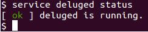

Title: Raspberry Pi + Deluge = Segmentation Fault
Date: 2014-01-09 15:43
Category: FOSS
Tags: Mysteries Solved, Linux, BitTorrent, Raspberry Pi, raspberrySeed, Ramblings, Deluge
Slug: raspberry-pi-deluge-segmentation-fault
OldSlug: raspberry-pi-deluge-segmentation-fault

**Note:** This is relevant to any ARM based device running Linux

I'm trying to use a Raspberry Pi as a torrentbox (an always-on
BitTorrent client).  
If I ever finish this project, I'll defiantly post my build.  
Anyway, I had a really annoying problem - every once in a while, the
Deluge daemon would crash, printing only this message as a reason:  

    Segmentation Fault

(Meaning that the program tried to access a part of the memory it's not
allowed to.)  

I made sure I'm running the latest version of deluge (as offered by the
rPi debian repository), and attempted to troubleshoot.   
I tried running deluge using debug logging, but found no consistent
message pattern before the crash, probably meaning that the code causing
the fault wasn't message-worthy or it meant to log its action after the
line responsible for the crash.   
Since then I've been ignoring it and simply restarting the daemon every
now and then, but today it wouldn't stay running for 5 minutes, so I had
to do something.  
Even though I know very little about Linux troubleshooting, I've decided
to try and use GDB (GNU Debugger) to try and understand the cause.  
I used these commands to recreate the problem in gdb:  

~~~~text
$ gdb --args python /usr/bin/deluged -d -L info
(gdb) handle SIGILL nostop
(gdb) run
~~~~

The `deluged` (deluge daemon) arguments are used to tell deluged to avoid
"daemonising" (so to stay attached to console) and to log to screen
information messages.  
The `handle` line is because libcrypto is testing the CPU features on
initialization, and creates (and handles) a fake "Illegal Instruction"
error ([link](http://www.raspberrypi.org/phpBB3/viewtopic.php?p=155085)).  
`run` tells deluged to start executing, and then we wait for the
inevitable crash.  
The crash looked something like this:  

~~~~text
Program received signal SIGSEGV, Segmentation fault.
[Switching to Thread 0xb5a5e470 (LWP 10169)]
RC4 () at /usr/lib/arm-linux-gnueabihf/libcrypto.so.1.0.0
~~~~

So the "guilty" code is libcrypto. Let's search for its owner:  

~~~~text
$ apt-cache search libcrypto
libcrypto++-dev - General purpose cryptographic library - C++ development
libcrypto++-doc - General purpose cryptographic library - documentation
libcrypto++-utils - General purpose cryptographic library - utilities and data files
libcrypto++9 - General purpose cryptographic library - shared library
libcrypto++9-dbg - General purpose cryptographic library - debug symbols
libcryptokit-ocaml - cryptographic algorithm library for OCaml - runtime
libcryptokit-ocaml-dev - cryptographic algorithm library for OCaml - development
libssl-dev - SSL development libraries, header files and documentation
libssl-doc - SSL development documentation documentation
libssl1.0.0 - SSL shared libraries
libssl1.0.0-dbg - Symbol tables for libssl and libcrypto
~~~~

As we can see, it's part of `libssl1.0.0`. Since these are also
up-to-date, I don't want to touch them. After examining the backtrace in
gdb:  

~~~~text
(gdb) thread apply all backtrace
...
Thread 3 (Thread 0xb5a5e470 (LWP 10169)):
#0  0xb6568c7c in RC4 () from /usr/lib/arm-linux-gnueabihf/libcrypto.so.1.0.0
#1  0xb67acee4 in libtorrent::bt_peer_connection::send_buffer(char const*, int, int) () from /usr/lib/libtorrent-rasterbar.so.6
#2  0xb67ab3ec in libtorrent::bt_peer_connection::append_const_send_buffer(char const*, int) () from /usr/lib/libtorrent-rasterbar.so.6
#3  0xb68b6b30 in ?? () from /usr/lib/libtorrent-rasterbar.so.6
#4  0xb68b6b30 in ?? () from /usr/lib/libtorrent-rasterbar.so.6
Backtrace stopped: previous frame identical to this frame (corrupt stack?)
...
~~~~

I can see it's being called by `libtorrent::bt_peer_connection`, so
it's probably related to peer-to-peer encryption.  
Disabling it wasn't trivial either - since I couldn't get deluged to run
for more than one minute, I had to edit the configuration file
manually.  
After editing the file `~/.config/deluge/core.conf` and changing these
settings:

- `"enc_level"` from `2` to `0`  
- `"enc_prefer_rc4"` from `true` to `false`

Everything seems to be normal now. I'm still not fully aware what are
the friendly names of those settings.  
  
Of course this is only a workaround, but at least I can use Deluge
again.

What an adventure!
