Title: Reverse Lookup in SharePoint 2010
Date: 2012-12-29 15:34
Category: Microsoft
Tags: Mysteries Solved, SharePoint, Office
Slug: reverse-lookup-in-sharepoint-2010
OldSlug: reverse-lookup-in-sharepoint-2010

Every SharePoint noob knows that one can create list lookup
relationships, like specifying that a book belongs in a specific
bookshelf.  
What I didn't know until today is SharePoint 2010 supports "reverse
lookup" out of the box!

### What's Lookup?
Consider this.You have 2 lists in your SharePoint site - one that
contains books, and one that contains bookshelves:  
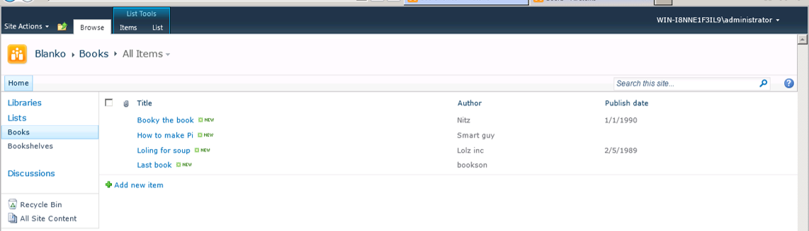  
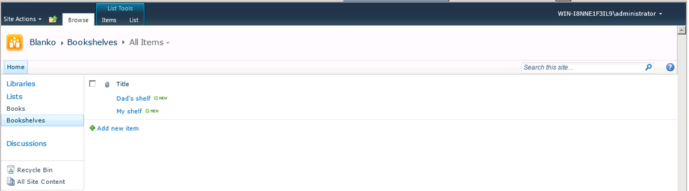  
--------------------------------------

You now create a lookup column in the "Books" list that contains the
bookshelf that the book belongs to. That's easy:  
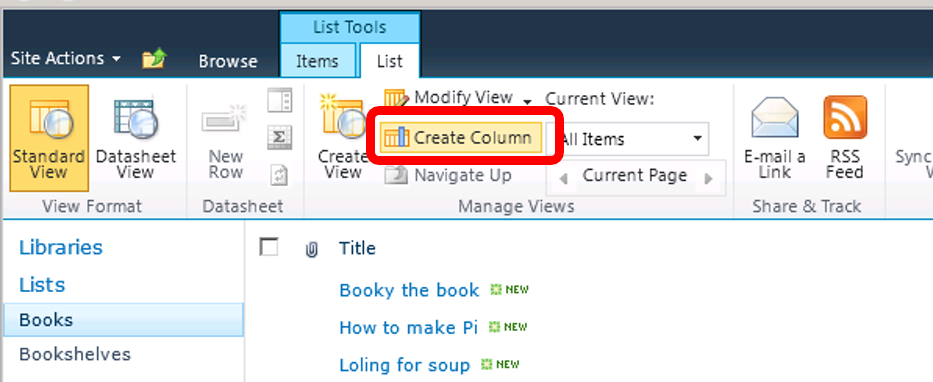  
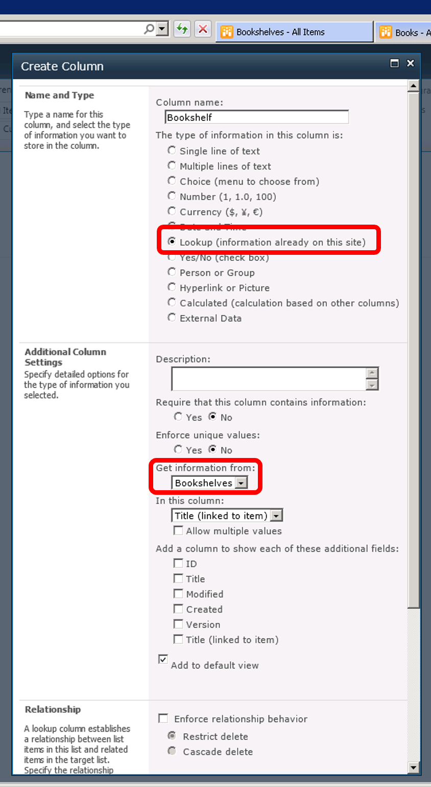  
-------------------------------------------------------------

And now you can easily see where every book belongs to, and you have
nice options such as "data integrity enforcement" (not allowing books to
remain in a deleted bookshelf) and "linked columns" (adding additional
bookshelf-related data to the book list based on the relevant
bookshelf)  
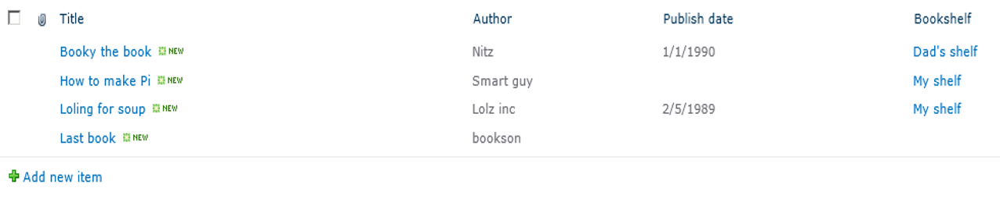  

### What's **reverse** Lookup?
After you finisehd writing your library contents into SharePoint, you
want to see all of the books belonging to each bookshelf.  
A tried and true idea is to filter the book list using the bookshelf
column, like this:  
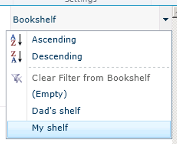  
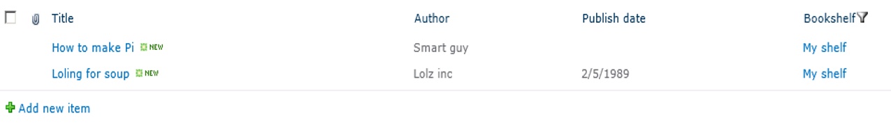  
-------------------------------------------------------------

Which is fine, but very troublesome. I wanted the exact opposite of
lookup - the ability to view from every bookshelf item the matching
books!

### My original idea
My original plan was to create a custom field type that contains no data
and has a list-viewing webpart in its display mode that shows the
referencing items from the child list (the book list in our case). I was
halfway done when I thought about how to call my blog post, and decided
to Google that before making any further progress.  
For the curious ones, I was trying to find out how to add field
parameters (such as "allow multiple selections") for my custom field.  

### The Solution
I stumbled upon some articles announcing that such a thing exists in
SharePoint 2010 OOTB but didn't mention where it's located. So I started
exploring, and found it! It's called "Related List" under "Insert". For
our example, I'll add a webpart showing the books contained in the shelf
in the shelf list's item display form:  
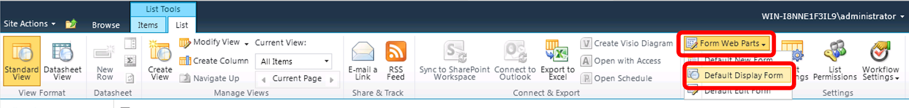  
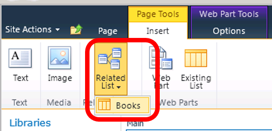  
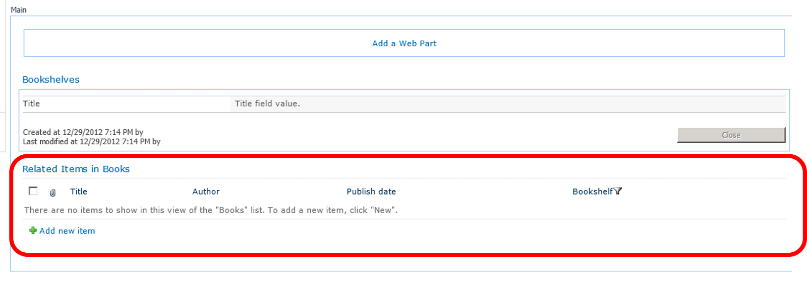  
You can now customize the webpart in any normal way, and the best thing
- it's not  breaking the form in any way (you can still customize field
display etc. thorough the setting pages).  
The end result looks like that:  
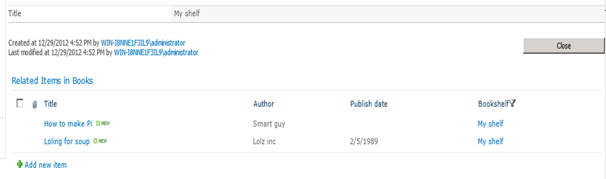  

Enjoy your 2-way lookup!

