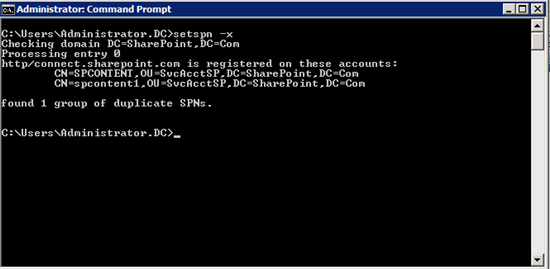
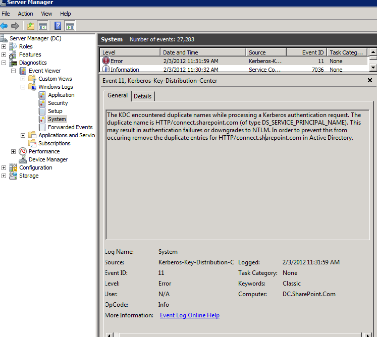

Title: setspn Duplicates and Case Sensitivity
Date: 2014-01-09 17:06
Category: Microsoft
Tags: Kerberos, Security, Scripts, Windows, Power Management, One-Liner, Event Log, Active Directory
Slug: setspn-duplicates-and-case-sensitivity
OldSlug: setspn-duplicates-and-case-sensitivity

Today I found out that the command I use to find duplicate SPNs, `setspn -x`  
  
is case sensitive, meaning that the following SPNs don't count as
duplicates:  
~~~~text
HOST/bla
HOST/BLA
~~~~
This makes sense when using UNIX systems for TGS creation.  
However, Active Directory Domain Controllers, being Windows systems, are
case-insensitive and don't differentiate between the two. You could even
get [event 11](http://technet.microsoft.com/en-us/library/cc733945%28v=ws.10%29.aspx)
because of such duplication.  
  
Since `setspn` didn't work, I wrote a few lines of my own that search the
current domain for duplicate SPNs.  
Since PowerShell can be made case sensitive, it can find different-cased duplicate SPNs easily.  

~~~~powershell
Get-ADObject -prop serviceprincipalname -fi {serviceprincipalname -like '*'} | %{
    $name = $_.DistinguishedName
    $_.ServicePrincipalName | select @{name='SPN';Expression={$_}},@{name='DN';Expression={$name}}
} | group SPN  | ?{$_.Count -gt 1} | select count,@{Name='SPN';Expression={$_.Name}},@{Name='DN';Expression={$_.Group | select -exp DN}}
~~~~

Images from [SharePoint FoxHole](http://blogs.technet.com/b/sharepoint_foxhole/archive/2012/02/03/kerberos-fatfingeritis-how-to-set-your-kerby-spns-the-safe-way.aspx)
