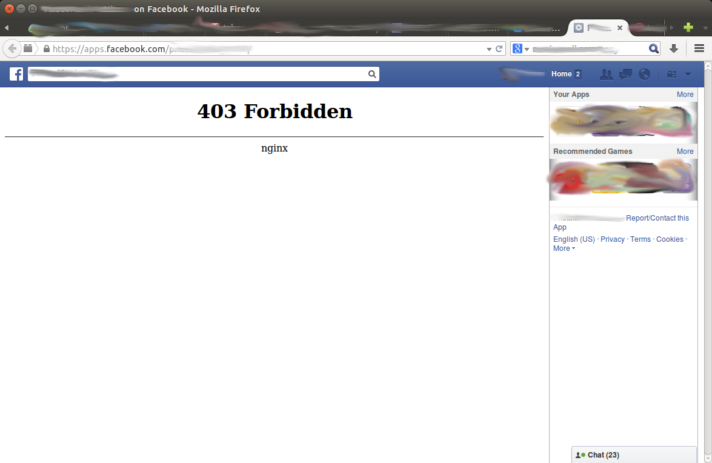

Title: Testing Local Facebook Applications with ABE
Date: 2014-05-05 12:59
Category: FOSS
Tags: Security, Facebook, Development, NoScript, Firefox, HTTP
Slug: testing-local-facebook-applications-with-abe
OldSlug: testing-local-facebook-applications

I'm using Firefox with [NoScript](http://noscript.net/), which is the
AdBlock of scripts - allowing you to selectively block scripts according
to various rules (e.g. block all scripts from analytics.google.com), and
additionally helps protecting you from XSS ([cross site
scripting](http://en.wikipedia.org/wiki/Cross-site_scripting)).  
One of the components in NoScript is ABE ([Application Boundaries
Enforcer](http://noscript.net/abe/)), which I see as a replacement for
Internet Explorer's zones.  
It comes populated with one rule - preventing non-local sites from
accessing local resources (for example, preventing `www.evilsite.com` from
invoking `file:///etc/group` to learn about your local groups).  
Problem is, when developing Facebook applications, you usually want to
run the application locally (because it's much easier to modify and
debug), but still view it from the Facebook website (because Facebook
populates your site with some needed variables that way).  
When I tried doing that in firefox, I found out that ABE was protecting
me:  

My immediate thought was to disable ABE while
developing, but I've decided to take this opportunity to learn how it
works.  
I saw the different rule looks like this:
~~~~text
# Prevent Internet sites from requesting LAN resources.
Site LOCAL
Accept from LOCAL
Deny
~~~~

And after adding this rule above it:
~~~~text
# The "." are at the beginning on purpose!
Site .My-Computer.FQDN
Accept ALL from .facebook.com
~~~~

ABE no longer blocked it:  

Now I have my own bugs to deal with :)
