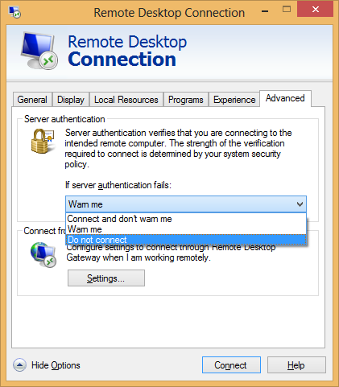
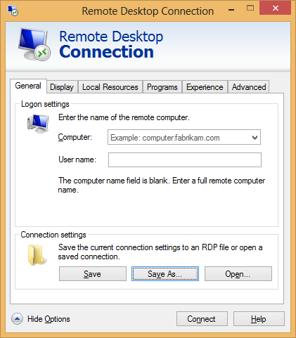

Title: Using Remote Desktop Client without Network Level Authentication
Date: 2013-11-11 18:07
Category: Microsoft
Tags: Security, Windows, Terminal Server
Slug: using-remote-desktop-client-without-network-level-authentication
OldSlug: using-remote-desktop-client-without

Whenever I use Remote Desktop to connect to an NT6+ (Windows Vista /
Windows Server 2008 and later) machine, I use Network Level
Authentication, meaning that authentication with the server is performed
before session is created (contrary to first connecting to the server
and using its GUI to enter the credentials). Usually this is a good
behavior, saving me from man-in-the-middle attacks.  
However, sometimes I wish to disable it at the client level, usually for
troubleshooting.  
Turns out it's not that easy. One can mandate NLA by using the
`Advanced` tab, under `Server Authentication`:  

  
but in order to avoid using it completely, you have to save your
connection as an RDP file using "Save As":  

And then edit the file using notepad and add the line:

~~~~text
enablecredsspsupport:i:0
~~~~

#### Sources
<http://technet.microsoft.com/en-us/library/ff393716%28v=ws.10%29.aspx>  
<http://support.microsoft.com/kb/941641>
