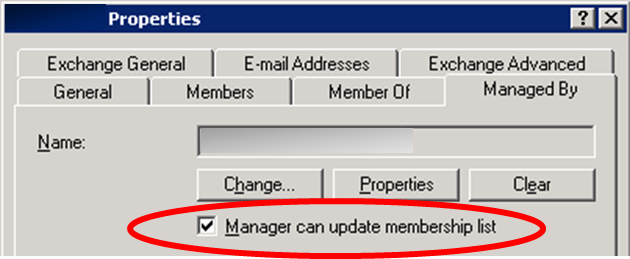

Title: Vanishing permissions on AD objects
Date: 2010-12-22 22:14
Category: Microsoft
Tags: Mysteries Solved, Active Directory, Security
Slug: vanishing-permissions-on-ad-objects
OldSlug: vanishing-permissions-on-ad-objects

I recently managed to solve a problem that bugged me for a ~ year -
permissions on a specific group on AD would vanish, and the change won't
show up on the security logs of any DC (as audit success).  
#### The Story  
We've made groups for our helpdesk teams, and
gave them appropriate permissions on object in AD (create users, reset
passwords) and made the groups members of some builtin groups. Then,
we've set each helpdesk supervisor as its group's `managed by`,
with the additional "Manager can update membership list" (translates to
an ACE on the group).  

The problem was that every other day, the supervisor called and
complained he can't add people to the group. We checked the group
properties, and sure enough, the check was gone!  
  
After mutual accusations and name calling I've tried:  

-   Auditing all changes to the group. Didn't help. My changes get
    logged, the mystery ones didn't.
-   Manually adding permissions through the security tab, giving the guy
    `full control` on the group. These ACEs fizzled just the same.
-   Changing the group's location. Nothing.

### The solution
Eventually, I've found [this (KB817433)](http://support.microsoft.com/kb/817433), that describes some
interesting mechanism called `AdminSDHolder`. Apparently, some builtin
objects are considered sensitive, because users in control over these
objects can maliciously elevate themselves to enterprise-adminhood:   
Users:  

-   Administrator
-   Krbtgt

 Groups:  

-   Administrators
-   Account Operators
-   Server Operators
-   Print Operators
-   Backup Operators
-   Domain Admins
-   Schema Admins
-   Enterprise Admins
-   Cert Publishers

So, every hour (by default, can be changed. See KB), the PDC makes sure
these objects' ACLs are identical to the ACL of the object `CN=adminSDHolder,CN=System,DC=mydomain,DC=com` and if not, it resets the objects' ACLs (and disables security
inheritance from their container).  
The shocker is that **members in these groups are also sensitive**. As
it happens, we've added the helpdesk group to the builtin "Print
Operators" (for no good reason). Because of that, our helpdesk group was
considered sensitive by the PDC, and so it repeatedly stripped the team
leader's ACE. After removing the group from "Print Operators", the ACE
never disappeared again!  
So remember kids, if you add users / groups to the builtin ones, you'll
only have the default boring ACL on these.
