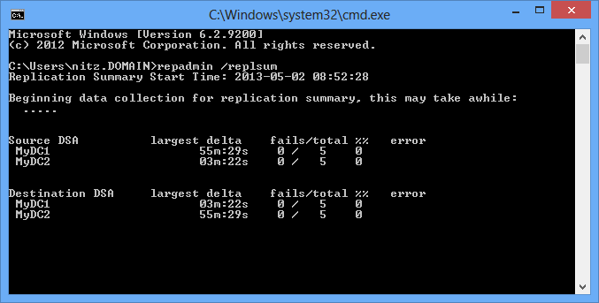
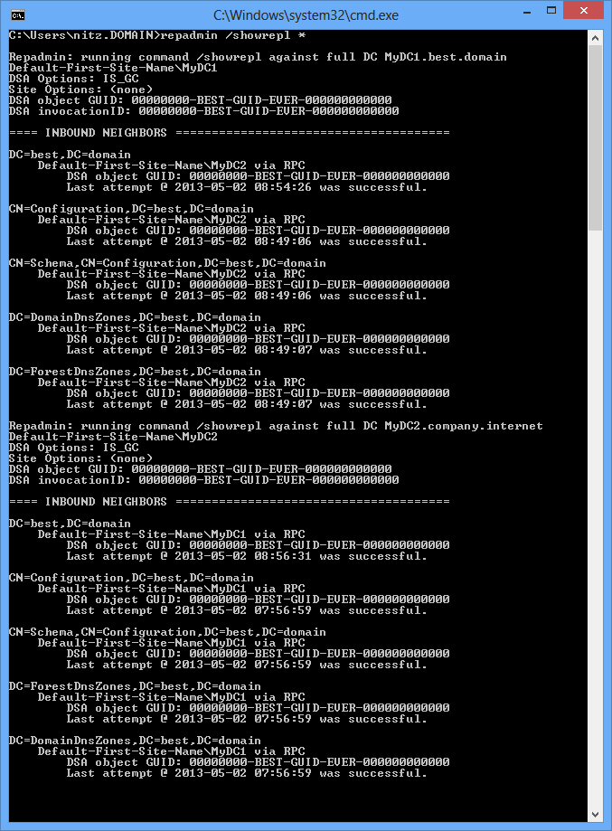
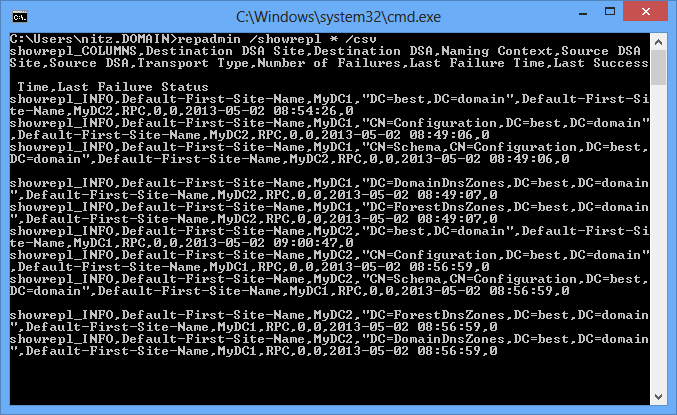
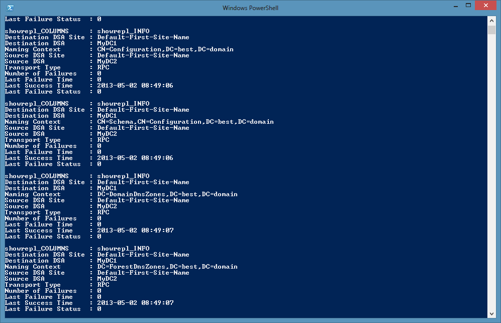
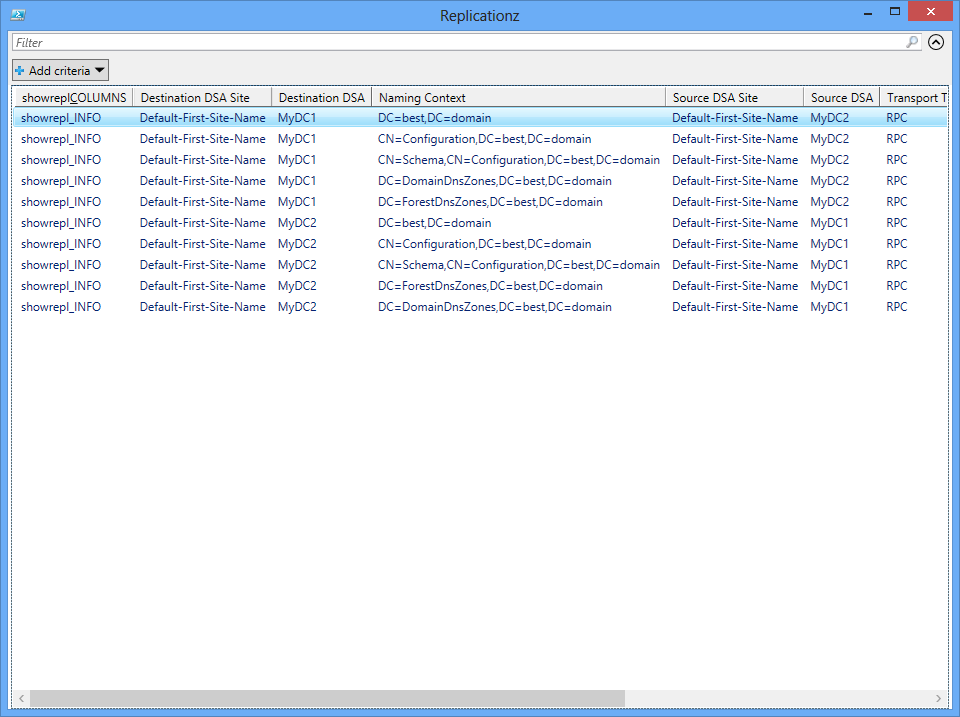

Title: Viewing detailed replication status using Repadmin and PowerShell
Date: 2013-05-03 11:46
Category: Microsoft
Tags: Scripts, PowerShell, One-Liner, Active Directory
Slug: viewing-detailed-replication-status-using-repadmin-and-powershell
OldSlug: viewing-detailed-replication-status

Whenever I want to view the replication status in my domain, I use
`repadmin /replsum`, which queries all of the DCs and gives me a summary
of the replication links status per DC, which looks a little like this:  

If I wanted to get detailed information, I'd use `repadmin /showrepl *`
which would print some information for every replication link:  

Since I have more than two DCs in some environments, looking at all of
the information is quite a long read and I usually avoid using this
option unless I have to.  
Recently, I discovered a nifty trick.  
`repadmin /showrepl` has a csv option, which isn't exciting by itself:  
~~~~bat
repadmin /showrepl * /csv
~~~~

However, combined with PowerShell's `ConvertFrom-Csv`, I could convert
the link status rows into objects and filter them within PowerShell:  
~~~~powershell
repadmin /showrepl * /csv | ConvertFrom-Csv
~~~~

Now, for example, if I wanted to view all links that had replication
errors, I could use  

~~~~powershell
repadmin /showrepl * /csv | ConvertFrom-Csv | ?{$_.'Number Of Failures'}
~~~~

And I can even display all of the links in GridView, for ease of use:  

~~~~powershell
repadmin /showrepl * /csv | ConvertFrom-Csv | ogv
~~~~

Enjoy!
